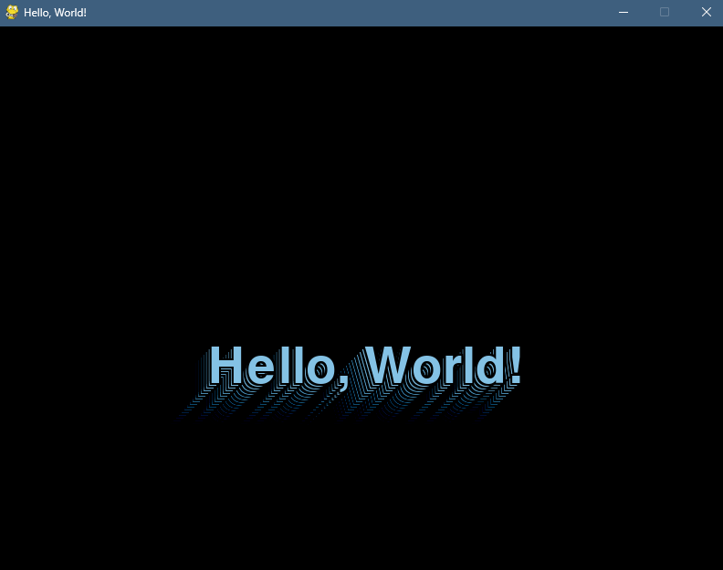

# HelloWorld
## Description
A more sophisticated way to print 'Hello, World!'. It’s a cool first program, I suppose...
The text changes colors upon hitting the edges and leaves a fading trail, similar to the classic DVD screensaver. This project uses the Pygame library to handle graphics and animation.

- **Bouncing Text**: The text moves around the screen, bouncing off the edges.
- **Dynamic Colors**: The text changes color each time it hits a wall.
- **Fading Trail**: The text leaves a fading trail effect as it moves, enhancing the visual appeal.

## Requirements
- Python 3.x
- Pygame library

## Installation
1. Clone this repository:
   ```bash
   git clone https://github.com/darrengls/HelloWorld
   cd ~/HellowWorld
   pip install pygame
   python hello_world.py
